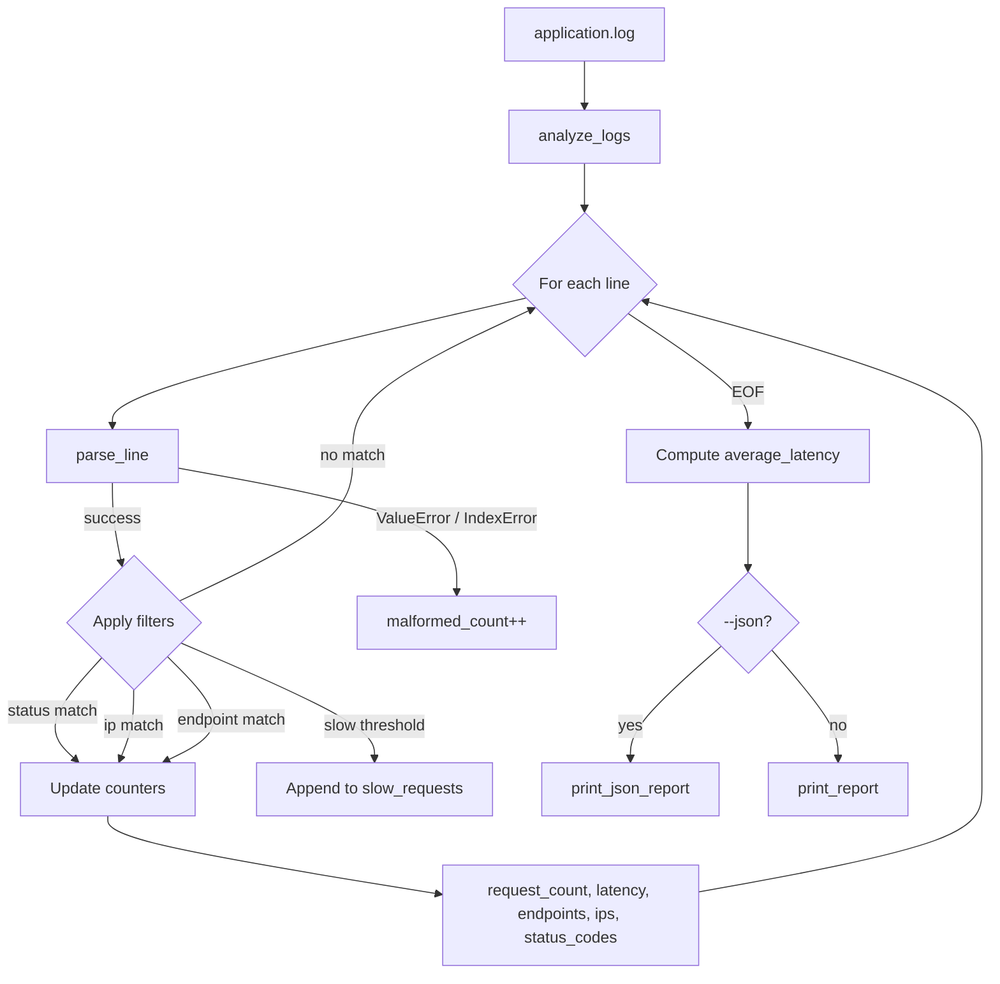

# CLI Log Analyzer

A lightweight Linux command-line tool for analyzing application logs and
generating operational metrics such as request volume, errors, latency,
top endpoints, top IPs, and HTTP status-code distribution.

## Features

- Parse application logs line-by-line
- Calculate total requests
- Detect HTTP errors
- Calculate average latency
- Identify maximum latency
- Find top API endpoints
- Find top client IPs
- Analyze HTTP status-code distribution
- Detect malformed log entries
- Filter by HTTP status
- Filter by IP address
- Filter by endpoint
- Identify slow requests
- Limit top-N results
- JSON output for automation
- Graceful file-error handling
- Automated unit tests

---

## Architecture

### Overview

The CLI Log Analyzer is a **single-pass, stream-oriented log processor**. It reads
an application log file line by line, parses each entry into a structured record,
applies optional filters, aggregates metrics in memory, and renders a human-readable
or machine-readable report.

The design follows a simple **parse → filter → aggregate → report** pipeline with
no external dependencies beyond the Python standard library.

```text
┌─────────────┐     ┌──────────────┐     ┌─────────────┐     ┌──────────────┐
│  log-analyzer│────▶│ log_analyzer │────▶│ analyze_logs│────▶│ print_report │
│  (bash entry)│     │    .py       │     │  (engine)   │     │  or JSON     │
└─────────────┘     └──────────────┘     └─────────────┘     └──────────────┘
                            │                     │
                            ▼                     ▼
                     parse_arguments()      parse_line()
                     (argparse CLI)         (per-line parser)
```

### Component breakdown

| Component | File | Responsibility |
|-----------|------|----------------|
| **Entry point** | `log-analyzer` | Bash wrapper that invokes `python3 log_analyzer.py` |
| **CLI layer** | `log_analyzer.py` → `main()` | Parses arguments, handles file errors, routes output |
| **Argument parser** | `parse_arguments()` | Defines flags: `--top`, `--slow`, `--status`, `--ip`, `--endpoint`, `--json` |
| **Line parser** | `parse_line()` | Converts a raw log line into a structured dictionary |
| **Analysis engine** | `analyze_logs()` | Streams the file, filters records, computes aggregates |
| **Human output** | `print_report()` | Formats a terminal-friendly summary report |
| **JSON output** | `print_json_report()` | Serializes stats for scripting and automation |
| **Tests** | `test_log_analyzer.py` | Unit tests for parsing, aggregation, and error handling |

### Data flow



### Log record schema

Each valid log line is parsed into this internal structure:

```python
{
    "timestamp": "2026-09-19 10:00:01",
    "ip":        "192.168.1.10",
    "method":    "GET",
    "endpoint":  "/api/users",
    "status":    200,
    "latency":   120.0   # milliseconds (float)
}
```

**Parsing rules (`parse_line`):**

1. Split the line on whitespace into 7 fields
2. Combine fields `[0]` + `[1]` into `timestamp`
3. Cast `status` to `int`
4. Strip `ms` suffix from latency and cast to `float`
5. Raise `IndexError` or `ValueError` on malformed input

### Analysis engine (`analyze_logs`)

The engine maintains these accumulators during a single file read:

| Accumulator | Type | Purpose |
|-------------|------|---------|
| `request_count` | `int` | Total valid, filter-matching requests |
| `error_count` | `int` | Requests with `status >= 400` |
| `malformed_count` | `int` | Lines that failed parsing |
| `total_latency` | `float` | Sum of latencies (for average) |
| `max_latency` | `float` | Highest observed latency |
| `endpoint_counter` | `Counter` | Request count per endpoint |
| `ip_counter` | `Counter` | Request count per client IP |
| `status_counter` | `Counter` | Request count per HTTP status |
| `slow_requests` | `list` | Records exceeding `--slow` threshold |

**Filter order (per line):**

1. Parse line (skip and count as malformed on failure)
2. Apply `--status` filter (skip if mismatch)
3. Apply `--ip` filter (skip if mismatch)
4. Apply `--endpoint` filter (skip if mismatch)
5. Check `--slow` threshold (append to `slow_requests` if exceeded)
6. Increment all counters and update aggregates

**Error detection:** any HTTP status `>= 400` increments `error_count`.

### Output layer

Two output modes share the same stats dictionary:

**Terminal report (`print_report`):**

- Summary metrics (requests, errors, malformed, avg/max latency)
- Slow request table (if any)
- Top-N endpoints and IPs (`Counter.most_common(top)`)
- Full status-code distribution

**JSON report (`print_json_report`):**

- Same data serialized as JSON
- `Counter` objects converted to plain `dict`
- Suitable for piping into `jq`, CI pipelines, or dashboards

### CLI interface

```text
log-analyzer <filename> [options]

Options:
  --top N          Top N endpoints and IPs to display (default: 5)
  --slow MS        Flag requests slower than MS milliseconds
  --status CODE    Filter by HTTP status code
  --ip ADDRESS     Filter by client IP
  --endpoint PATH  Filter by API endpoint
  --json           Output results as JSON
```

### Project structure

```text
linux/
└── cli-log-analyzer/
    ├── log-analyzer          # Bash entry-point wrapper
    ├── log_analyzer.py       # Core application (CLI + engine + output)
    ├── test_log_analyzer.py  # Unit tests (unittest)
    ├── application.log       # Sample log file for manual testing
    ├── README.md
    └── .gitignore
```

### Design decisions

| Decision | Rationale |
|----------|-----------|
| **Single-pass streaming** | Memory-efficient for large logs; no need to load entire file |
| **`collections.Counter`** | Built-in, efficient frequency counting for top-N queries |
| **No external deps** | Runs anywhere Python 3 is available — true Linux CLI tool |
| **Graceful malformed handling** | Bad lines are counted, not fatal — mirrors real-world noisy logs |
| **Separate bash wrapper** | Familiar `./log-analyzer` UX without requiring `python3` in muscle memory |
| **Dual output modes** | Human-readable for debugging; JSON for automation |

### Extension points

Future enhancements that fit naturally into this architecture:

- **Custom log formats** — plug in alternate parsers alongside `parse_line()`
- **Time-range filtering** — filter by `timestamp` before aggregation
- **Percentile latency** — extend the latency accumulator (p50, p95, p99)
- **Output to file** — add `--output report.json` flag in `parse_arguments()`
- **Streaming stdin** — read from pipe (`cat app.log | log-analyzer -`) for live tail analysis

---

## Log Format

The analyzer expects logs in the following format:

```text
TIMESTAMP IP METHOD ENDPOINT STATUS_CODE LATENCY
```

Example:

```text
2026-09-19 10:00:01 192.168.1.10 GET /api/users 200 120ms
```

| Field | Example | Notes |
|-------|---------|-------|
| Date | `2026-09-19` | ISO date |
| Time | `10:00:01` | 24-hour time |
| IP | `192.168.1.10` | Client IP address |
| Method | `GET` | HTTP method |
| Endpoint | `/api/users` | Request path |
| Status | `200` | HTTP status code |
| Latency | `120ms` | Response time with `ms` suffix |

---

## Usage

### Basic analysis

```bash
./log-analyzer application.log
```

### Top 10 endpoints and IPs

```bash
./log-analyzer application.log --top 10
```

### Find slow requests (> 500 ms)

```bash
./log-analyzer application.log --slow 500
```

### Filter by status code

```bash
./log-analyzer application.log --status 500
```

### Filter by IP or endpoint

```bash
./log-analyzer application.log --ip 192.168.1.10
./log-analyzer application.log --endpoint /api/users
```

### JSON output for automation

```bash
./log-analyzer application.log --json
./log-analyzer application.log --json > report.json
```

---

## Running tests

```bash
python3 -m unittest test_log_analyzer.py -v
```

Tests cover:

- Valid and invalid line parsing
- Request/error/malformed counting
- Endpoint, IP, and status-code aggregation
- Error detection for 4xx/5xx responses
